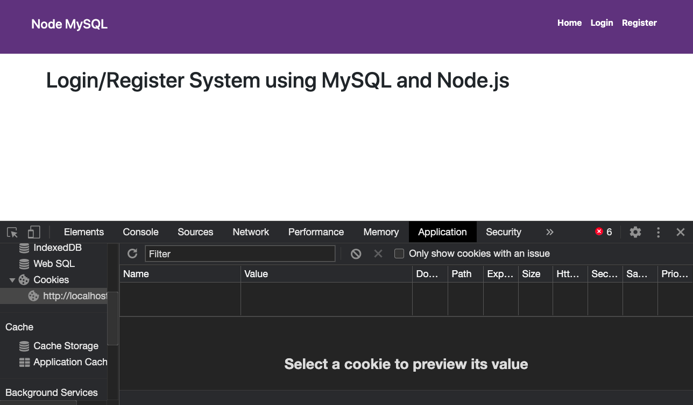
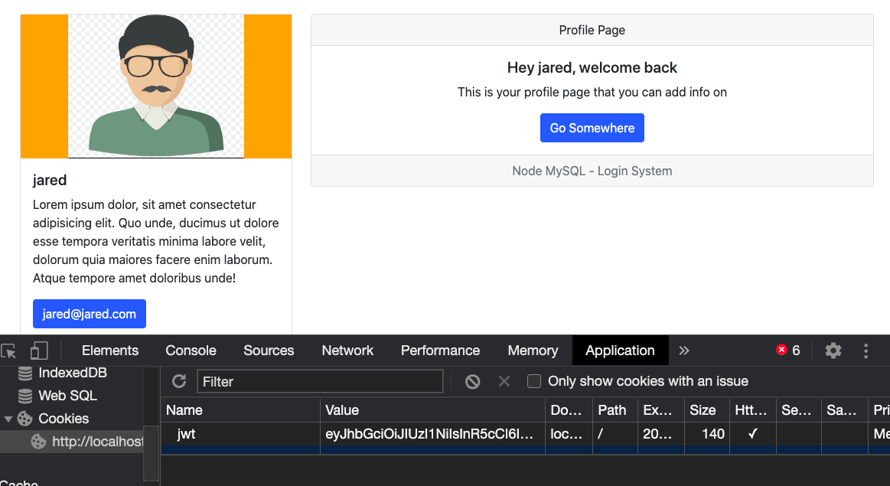

# Secure Login

This is a node.js and mySQL login system that includes protected routes based on a user.

## Technologies used:

- node.js
- express
- mySQL
- MAMP
- PHP MyAdmin
- dotenv
- handlebars.js (hbs view engine)
- HTML5
- CSS3
- Bootstrap
- bcryptjs
- jsonwebtoken
- cookie-parser

## Screenshots

#### Before a user logs in:

#### Logged in user, profile page and jwt:

